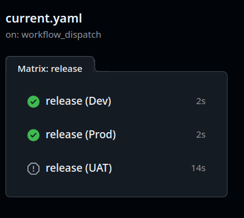

# Github action deploy strategy

## Current [current.yaml](.github/workflows/current.yaml)

- Can only have a max of two approval gated workflow runs
- When a third run arrives at a approval gate, the previous approval gated run is cancelled.
- With matrix, this causes the next environment to be run
